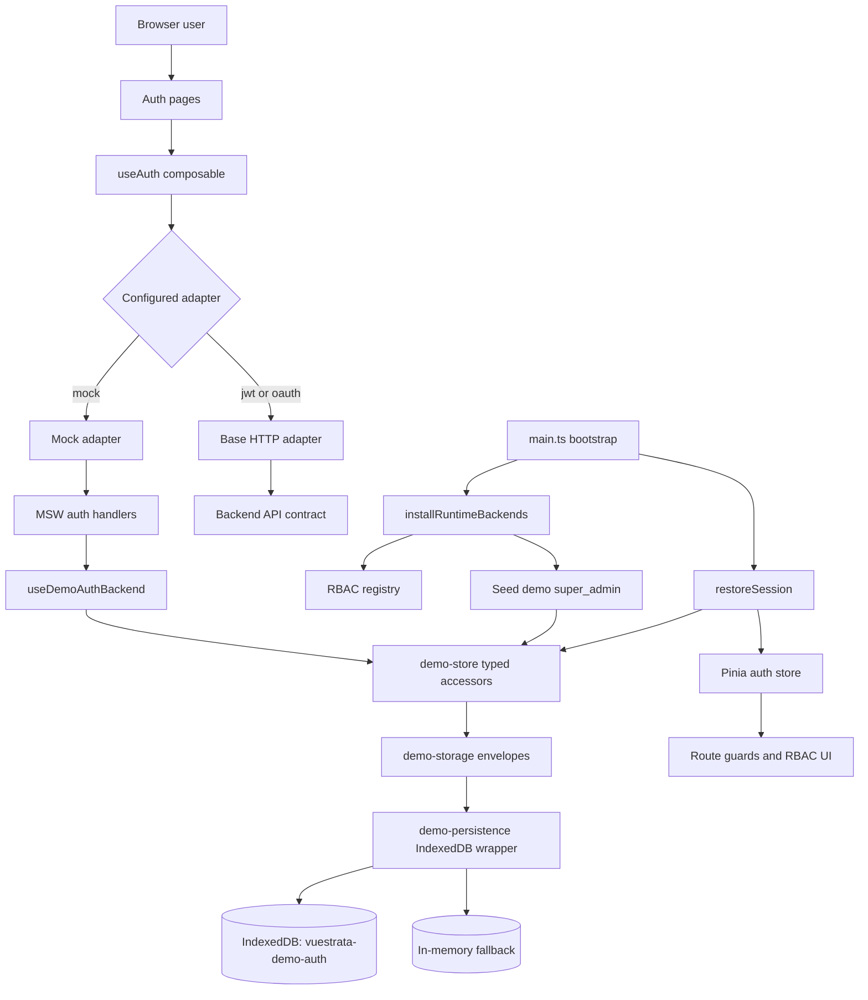
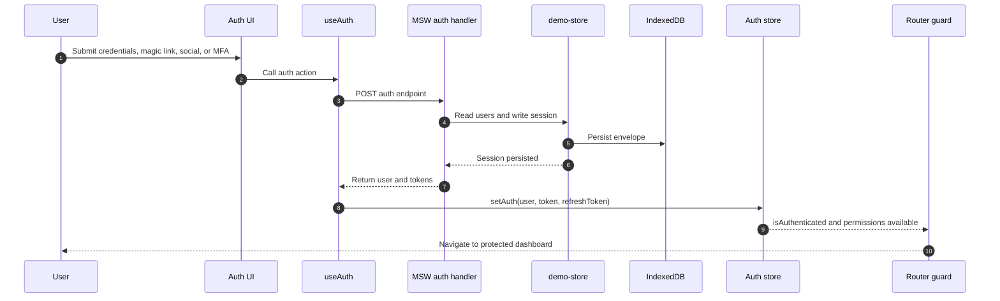
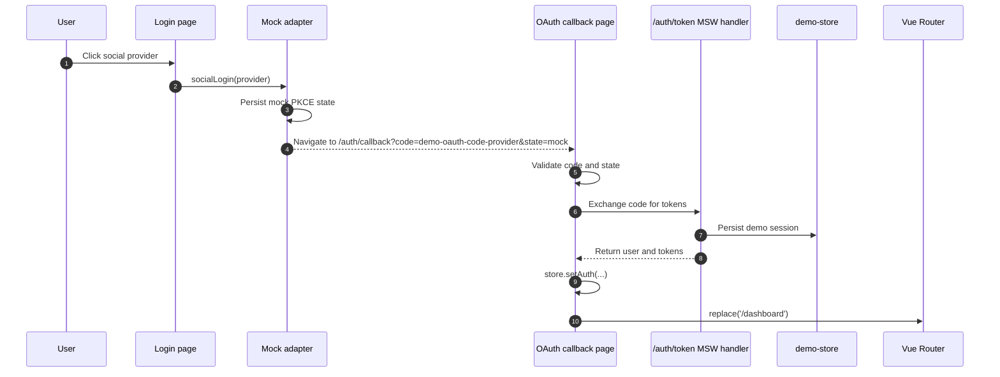
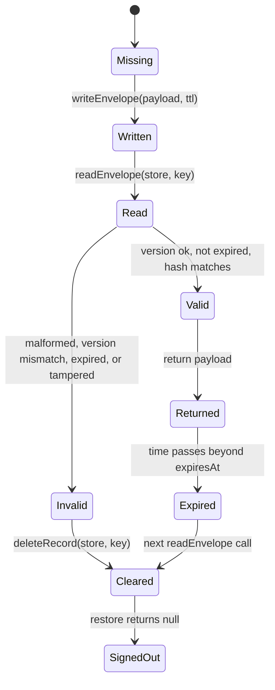
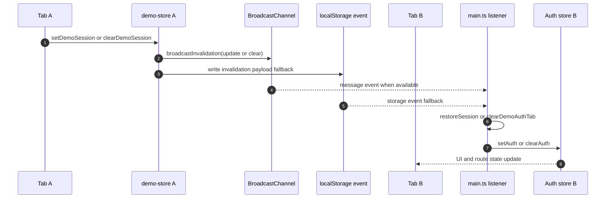
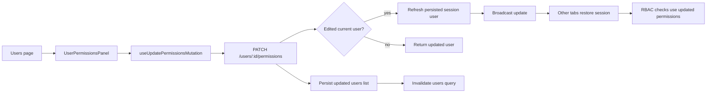

# Summary: Demo-First Auth Mocking With IndexedDB Persistence

**Date**: 2026-04-28  
**Status**: Auth implementation complete; auth browser matrix verified  
**Scope**: Spec 001 demo auth, IndexedDB persistence, mocked auth flows, user management, tests, and docs parity.

## Executive Summary

The demo auth system has been upgraded from mostly ephemeral mock behavior into a complete browser-local demo runtime. The mock adapter now supports credentials, registration, logout, refresh, magic link, social OAuth callback, MFA, session restore, user invitation, role updates, and explicit per-user permissions without requiring any external identity provider or backend service.

Demo users and sessions are persisted in IndexedDB through a shared app-level storage layer. Records are wrapped in versioned, time-bound envelopes with a salted SHA-256 integrity hash. Invalid, expired, malformed, or tampered records fail closed and are cleared before use. Cross-tab state is synchronized through `BroadcastChannel`, a `localStorage` storage-event fallback, and a mock-session polling fallback in app bootstrap.

The default demo account is seeded as a `super_admin` with all built-in permissions when the demo user store is empty. The users page now exposes invite and permission-management flows backed by persisted MSW handlers. Auth unit, component, integration, and dedicated Playwright browser-matrix coverage has been added and verified.

## Implementation Map

## What Was Added

### Shared Demo Persistence

- Added a native IndexedDB wrapper with in-memory fallback in [../../../src/modules/app/state/demo-persistence.ts](../../../src/modules/app/state/demo-persistence.ts).
- Added envelope creation, integrity validation, TTL enforcement, and invalidation events in [../../../src/modules/app/state/demo-storage.ts](../../../src/modules/app/state/demo-storage.ts).
- Added typed user/session accessors in [../../../src/modules/app/state/demo-store.ts](../../../src/modules/app/state/demo-store.ts).
- Added a shared `createGlobalState` backend for MSW handlers in [../../../src/modules/app/state/demo-auth-backend.ts](../../../src/modules/app/state/demo-auth-backend.ts).
- Added configurable retention through `appConfig.demoAuth.retentionHours`, sourced from `VITE_VUESTRATA_DEMO_AUTH_RETENTION_HOURS` with a default of `24` hours.

### Runtime Seed And RBAC

- Exported the built-in permission list from [../../../src/modules/app/state/runtime-backends.ts](../../../src/modules/app/state/runtime-backends.ts).
- Made `installRuntimeBackends()` asynchronous so it can seed the demo user store after RBAC permissions are registered.
- Seeded `demo@vuestrata.dev` as `super_admin` with all built-in permissions when no demo users exist.
- Preserved existing RBAC flow: explicit `user.permissions` are exposed through the auth store and consumed by `useRbac` and guarded UI.

### Mock Auth Flow Completion

- Migrated auth MSW handlers to persistent demo state in [../../../src/modules/auth/mocks/auth.handlers.ts](../../../src/modules/auth/mocks/auth.handlers.ts).
- Covered mocked endpoints for login, register, magic link request/verify, MFA setup/verify/disable, `/auth/me`, logout, refresh, OAuth token exchange, and provider redirects.
- Updated mock JWT generation to include explicit permission claims.
- Updated the mock adapter in [../../../src/modules/auth/composables/useAuth.ts](../../../src/modules/auth/composables/useAuth.ts) so logout clears persisted demo session state and social login uses deterministic mock PKCE state.
- Updated the OAuth callback page to set auth state and fire the dashboard redirect without awaiting a navigation promise that can hang in Firefox.

### Bootstrap And Cross-Tab Session Behavior

- Updated [../../../src/main.ts](../../../src/main.ts) to restore mock sessions from IndexedDB before the first routed view renders.
- Moved module route registration before router installation so the first navigation sees the final route table.
- Added app-level invalidation handling for demo auth updates and clears.
- Added a polling fallback for mock sessions so a tab clears itself if the persisted session disappears.

### Users Management Surface

- Added `POST /users`, role update persistence, and `PATCH /users/:id/permissions` persistence in [../../../src/modules/app/mocks/handlers/users.ts](../../../src/modules/app/mocks/handlers/users.ts).
- Added `useInviteUserMutation` and `useUpdatePermissionsMutation` under [../../../src/modules/users/composables](../../../src/modules/users/composables).
- Added [../../../src/modules/users/components/InviteUserDialog.vue](../../../src/modules/users/components/InviteUserDialog.vue) for demo user invitation.
- Added [../../../src/modules/users/components/UserPermissionsPanel.vue](../../../src/modules/users/components/UserPermissionsPanel.vue) for explicit permission editing.
- Wired invite and permission actions into [../../../src/modules/users/pages/users.vue](../../../src/modules/users/pages/users.vue).

### Login And Shell UX

- Added MFA challenge UI to [../../../src/modules/auth/pages/login.vue](../../../src/modules/auth/pages/login.vue).
- Cleared the password field after failed credential attempts.
- Added an authenticated sign-out action to [../../../src/modules/app/components/layout/AppHeader.vue](../../../src/modules/app/components/layout/AppHeader.vue).

### Test Coverage

- Added unit tests for persistence, envelopes, runtime seeding, challenge state, OAuth PKCE, and users mutations.
- Added component tests for the login page, users page, invite dialog, and permissions panel.
- Added integration tests for auth and users MSW handlers plus session restoration behavior.
- Added [../../../e2e/auth.spec.ts](../../../e2e/auth.spec.ts) and [../../../e2e/helpers/auth.ts](../../../e2e/helpers/auth.ts) to cover the full auth browser matrix.
- Updated existing forms, navigation, and accessibility e2e specs to authenticate before visiting protected routes.

### Documentation

- Updated module docs for users capabilities.
- Updated environment docs for demo auth retention.
- Updated auth/RBAC docs for default demo account, persistence, social login, magic link, and user-management behavior.
- Updated auth deep-dive docs for IndexedDB persistence and browser-local security caveats.
- Updated testing docs for runtime reset and demo IndexedDB cleanup guidance.

## Auth Flow Sequence

## OAuth Callback Flow

## Persistence Lifecycle

## Cross-Tab Invalidation

## User Permission Update Flow

## Coverage Matrix

| Area                  | Coverage added                                                   | Status |
| --------------------- | ---------------------------------------------------------------- | ------ |
| IndexedDB persistence | `demo-persistence`, `demo-storage`, `demo-store` unit tests      | Done   |
| Runtime seeding       | `runtime-backends` unit tests                                    | Done   |
| Lockout and MFA state | `challenge-store` unit tests                                     | Done   |
| OAuth PKCE            | `oauth-pkce` unit tests                                          | Done   |
| Users mutations       | Mutation unit tests                                              | Done   |
| Login page            | Component tests for credentials, social, magic link, and MFA     | Done   |
| Users UI              | Component tests for invite and permissions surfaces              | Done   |
| MSW handlers          | Integration tests for auth and users endpoints                   | Done   |
| Session restore       | Integration tests for valid, expired, and corrupted envelopes    | Done   |
| Browser auth flows    | Playwright matrix for auth flows and auth-backed user management | Done   |

## Verification Snapshot

Last recorded verification during this implementation:

| Command                                                                                                                     | Result                                                         |
| --------------------------------------------------------------------------------------------------------------------------- | -------------------------------------------------------------- |
| `vp exec playwright test e2e/auth.spec.ts --reporter=line`                                                                  | Passed, `40 passed`                                            |
| `vp test --run test/unit/app test/unit/auth test/unit/users test/component/users test/component/auth test/integration/auth` | Passed, `13 files`, `90 tests`                                 |
| `vp test --run`                                                                                                             | Passed, `40 files`, `486 tests`                                |
| `vp fmt --check`                                                                                                            | Passed                                                         |
| `vp check`                                                                                                                  | Completed with no errors and one existing warning outside auth |
| `vp build`                                                                                                                  | Passed with existing bundle/font warnings                      |

The broader Playwright suite was also attempted. The dedicated auth matrix was green, but the full e2e suite still had non-auth failures: `179 passed`, `97 failed`. Those failures were outside this auth spec and were concentrated in existing forms/mobile sidebar interaction and accessibility/navigation coverage.

## Current End State

- Demo mode no longer depends on live auth providers or backend auth infrastructure.
- Demo users and sessions survive reloads through IndexedDB for the configured retention window.
- Expired, malformed, version-mismatched, or tampered demo records are rejected fail-closed.
- Default demo bootstrap creates a full-permission `super_admin` when needed.
- Auth state restores before initial route rendering in mock mode.
- Logout and permission/session changes propagate across tabs with multiple fallbacks.
- Users can be invited and assigned explicit permissions through the demo UI.
- Auth-focused unit, component, integration, and browser-matrix tests are in place and have been verified.

## Known Follow-Up Outside This Spec

The remaining open test work is the non-auth Playwright suite. The failures observed there are not caused by the auth matrix itself and should be handled as a separate e2e stabilization pass, especially around mobile sidebar overlay behavior, forms interactions, and accessibility assertions.
