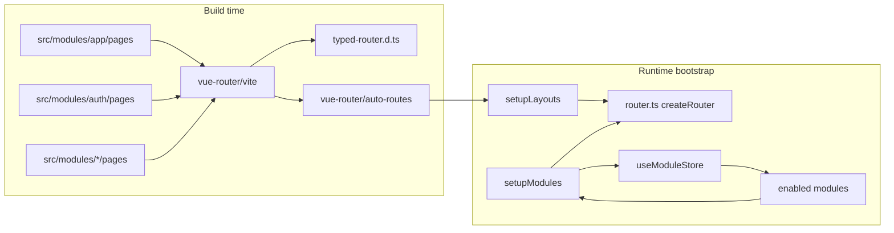
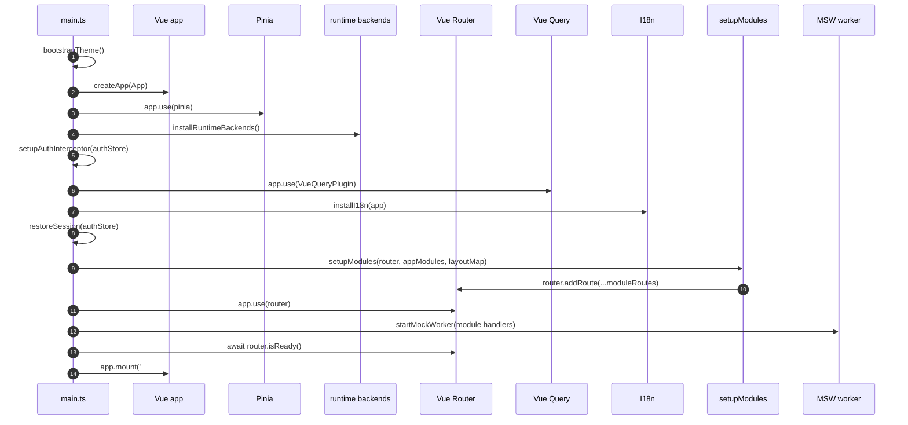
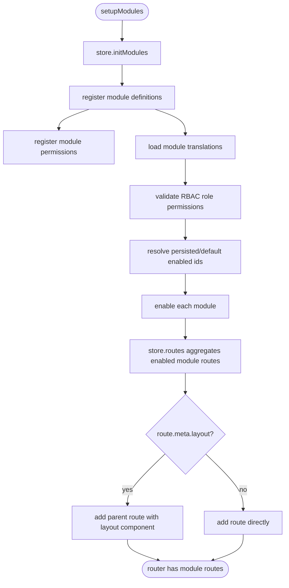
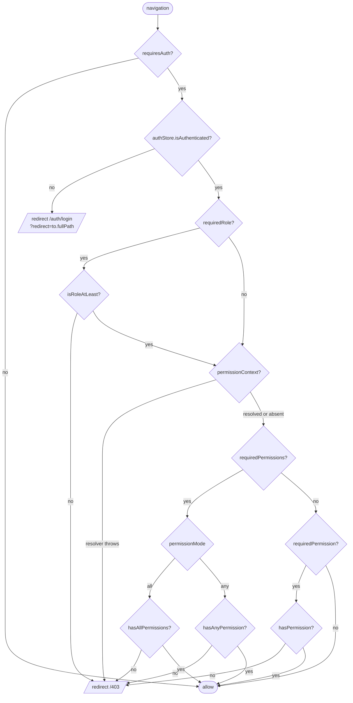
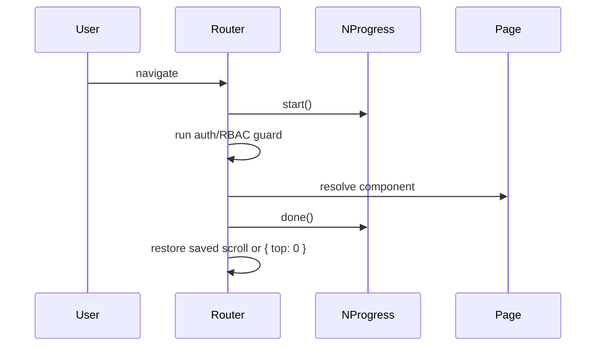

# Routing System

Vuestrata uses Vue Router with two route sources:

- File-based routes generated at build time by Vue Router 5.
- Module-contributed routes registered at runtime after enabled modules are resolved.

Both route sources use the same Vue Router instance and the same `RouteMeta` contract.
The important distinction is timing: file routes exist when the router is created, while module
routes are added later during app bootstrap.

## Big Picture



The static route tree is created in `src/modules/app/plugins/router.ts`:

```ts
function resolveStaticRoutes(fileRoutes: readonly RouteRecordRaw[]): RouteRecordRaw[] {
  return [
    { path: '/settings', redirect: '/dashboard/settings' },
    ...(setupLayouts([...fileRoutes]) as RouteRecordRaw[]),
  ]
}

export const router = createRouter({
  history: createWebHistory(),
  routes: resolveStaticRoutes(routes),
  scrollBehavior(_to, _from, savedPosition) {
    return savedPosition ?? { top: 0 }
  },
})

if (import.meta.hot) {
  handleHotUpdate(router, (newRoutes) => {
    router.clearRoutes()
    for (const route of resolveStaticRoutes(newRoutes)) {
      router.addRoute(route)
    }
  })
}
```

The generated `routes` import comes from `vue-router/auto-routes`. The app then runs those routes
through `setupLayouts(...)` so page routes can use layout metadata. In development,
`handleHotUpdate(router, ...)` keeps the same redirect and layout wrapping when page files change.

## Route Sources

### File-Based Routes

`vite.config.ts` configures Vue Router's Vite plugin with two roots:

```ts
VueRouter({
  routesFolder: [
    { src: 'src/modules/app/pages' },
    { src: 'src/modules/auth/pages', path: 'auth/' },
    { src: 'src/modules/*/pages' },
  ],
  extensions: ['.vue'],
  exclude: ['**/_components/**'],
  dts: 'typed-router.d.ts',
})
```

Vue Router's Vite plugin scans app pages, auth pages, and module page files. The wildcard module
folder keeps typed route generation aware of module-owned page components, while the app still
declares public feature URLs explicitly through each module's `routes` array.

That means:

| Folder                                     | Route behavior    |
| ------------------------------------------ | ----------------- |
| `src/modules/app/pages/index.vue`          | `/`               |
| `src/modules/app/pages/docs/[...slug].vue` | `/docs/:slug(.*)` |
| `src/modules/app/pages/403.vue`            | `/403`            |
| `src/modules/auth/pages/login.vue`         | `/auth/login`     |
| `src/modules/auth/pages/register.vue`      | `/auth/register`  |
| `src/modules/auth/pages/callback.vue`      | `/auth/callback`  |

Use file routes for application-level pages that should always exist, such as docs, auth pages,
component showcase pages, error pages, and the home page.

### Module Routes

Feature modules can contribute routes through their `ModuleDefinition`:

```ts
const billingModule: ModuleDefinition = {
  config: {
    id: 'billing',
    name: 'Billing',
    enabledByDefault: true,
    permissions: ['billing:read', 'billing:manage'],
    // ...
  },
  routes: [
    {
      path: '/dashboard/billing',
      component: () => import('./pages/billing.vue'),
      meta: {
        layout: 'dashboard',
        requiresAuth: true,
        requiredPermission: 'billing:read',
        module: 'billing',
      },
    },
  ],
}
```

Use module routes for feature pages that should only be present when their owning module is enabled.
Disabled modules do not contribute routes or navigation items.

## Bootstrap Order

Routing setup depends on Pinia, auth state, runtime backends, i18n, and module registration. The
order in `src/main.ts` is intentional.



The router instance must exist before `setupModules(...)`, but `app.use(router)` intentionally runs
after module routes are registered so the first navigation sees the final route table. Pinia and
i18n must both be ready before module setup reads stores or merges translations.

## Module Registration Flow

`setupModules(router, appModules, layoutMap)` is the bridge between module definitions and Vue
Router.



The store owns registration and enable/disable state. Route installation itself lives outside the
store because layout components and `router.addRoute(...)` are bootstrap concerns.

## Layout Handling

Static file routes are passed through `vite-plugin-vue-layouts` via `setupLayouts([...routes])`.
Module routes are added after that generated route tree already exists, so they are wrapped manually
when they declare `meta.layout`.

```mermaid
flowchart LR
  ModuleRoute[Module route\n/dashboard/billing] --> HasLayout{meta.layout = dashboard?}
  HasLayout -- yes --> Parent[router.addRoute parent\npath: /dashboard/billing\ncomponent: DashboardLayout]
  Parent --> Child[child route\npath: ''\ncomponent: BillingPage]
  HasLayout -- no --> Direct[router.addRoute(route)]
```

A dashboard module route becomes this structure at runtime:

```ts
router.addRoute({
  path: route.path,
  component: DashboardLayout,
  children: [{ ...route, path: '' }],
})
```

If a module declares an unknown layout name, the app logs a warning and registers the route without
the layout wrapper.

## Route Meta Contract

Module route metadata is defined in `src/modules/types.ts`:

```ts
export interface ModuleRouteMeta {
  requiresAuth?: boolean
  requiredRole?: Role
  requiredPermission?: Permission
  requiredPermissions?: Permission[]
  permissionMode?: 'all' | 'any'
  permissionContext?:
    Record<string, unknown> | ((to: RouteLocationNormalized) => Record<string, unknown> | undefined)
  layout?: string
  module?: string
}
```

That contract is applied globally with Vue Router module augmentation in
`src/modules/route-meta.d.ts`:

```ts
declare module 'vue-router' {
  interface RouteMeta extends ModuleRouteMeta {}
}
```

Because Vue Router's `RouteMeta` is augmented globally, module routes can use Vue Router's own
`RouteRecordRaw` type directly:

```ts
export type ModuleRoute = RouteRecordRaw
```

This keeps module route records aligned with Vue Router instead of maintaining a parallel route type.

## Guard Flow

All routes, generated or module-contributed, pass through the same global `beforeEach` guard.



Guard rules:

- `requiresAuth: true` redirects unauthenticated users to `/auth/login` and preserves the intended
  destination in `?redirect=`.
- `requiredRole` checks hierarchy with `isRoleAtLeast(...)`.
- `requiredPermissions` takes precedence over `requiredPermission`.
- `permissionMode` defaults to `'all'`; use `'any'` only when one matching permission is enough.
- `permissionContext` may be a static object or a function of the target route.
- If a `permissionContext` function throws, the guard fails closed and redirects to `/403`.

## Progress And Scroll

The router also owns small navigation-level UI concerns:



`router.onError(...)` also calls `NProgress.done()` so a failed navigation does not leave the
progress bar stuck.

## Adding A New Route

### Add An Always-On Page

Create a Vue file under `src/modules/app/pages`:

```text
src/modules/app/pages/403.vue -> /403
src/modules/app/pages/docs/[...slug].vue -> /docs/:slug(.*)
```

For auth pages, use `src/modules/auth/pages`; the configured route prefix makes
`login.vue` become `/auth/login`.

### Add A Module-Owned Feature Page

Add a route to the module's `index.ts`:

```ts
routes: [
  {
    path: '/dashboard/reports',
    component: () => import('./pages/reports.vue'),
    meta: {
      layout: 'dashboard',
      requiresAuth: true,
      requiredPermission: 'reports:read',
      module: 'reports',
    },
  },
]
```

Also add matching navigation when users should see the route in the sidebar:

```ts
navItems: [
  {
    label: 'sidebar_reports',
    icon: 'chart',
    to: '/dashboard/reports',
    permission: 'reports:read',
    order: 30,
  },
]
```

The route guard controls access. The nav item controls visibility. Keep both aligned, but do not
assume one replaces the other.

## What Belongs In A Page

Registering a route is one half of the contract; what the page component may
contain is the other. Pages are thin inbound adapters — they normalize route
input and compose a feature screen, and they do not hold reusable feature or
business logic. See [Route Pages](4.route-pages.md).

## Common Pitfalls

- Do not put reusable feature logic in a page component, and do not reach for
  `useRoute()`/`useRouter()` inside feature code that is not about navigation.
- Do not register auth pages as module routes; they are file-based under `src/modules/auth/pages`.
  The auth module only contributes mocks and public auth APIs.
- Do not hand-roll a separate route-record interface. `ModuleRoute` should stay aligned with
  Vue Router's `RouteRecordRaw`, and route meta should be extended through module augmentation.
- Do not call `setupModules(...)` before `app.use(pinia)` and `installI18n(app)`. It
  intentionally runs before `app.use(router)` so the first navigation sees the final route table.
- Do not rely on sidebar navigation for security. Navigation visibility and router authorization
  are separate layers.
- Do not silently ignore `permissionContext` failures. The guard intentionally fails closed.

## File Map

| File                                | Responsibility                                                                                          |
| ----------------------------------- | ------------------------------------------------------------------------------------------------------- |
| `vite.config.ts`                    | Configures file-based route discovery and typed route generation.                                       |
| `src/modules/app/plugins/router.ts` | Creates the router, installs progress hooks, auth/RBAC guard, and layout map.                           |
| `src/main.ts`                       | Installs Pinia, runtime backends, i18n, and module routes, then installs the router and mounts the app. |
| `src/modules/setup.ts`              | Lists built-in modules in startup order.                                                                |
| `src/modules/index.ts`              | Registers modules, enables persisted/default modules, and adds module routes.                           |
| `src/modules/types.ts`              | Defines `ModuleRouteMeta`, `ModuleDefinition`, and module route/nav contracts.                          |
| `src/modules/route-meta.d.ts`       | Augments Vue Router `RouteMeta` with module route metadata.                                             |
| `typed-router.d.ts`                 | Generated typed-router declarations from file-based routes.                                             |
