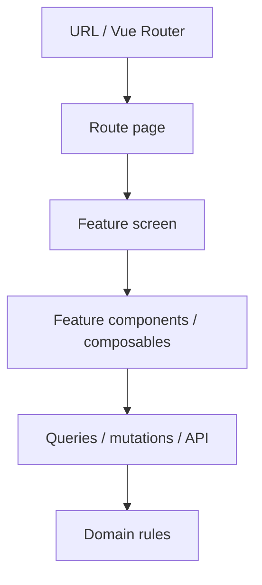

# Route Pages

**A page coordinates. It does not implement.**

A route page is the boundary between Vue Router and the rest of the application.
It translates router state into application-friendly inputs, handles the
concerns that genuinely belong to the URL, and composes a feature screen.



The arrows are one-way. A feature module must never import a page, and domain
or application code must never import router infrastructure.

## Controller Is A Mental Model, Not A Layer

"Inbound adapter" and "controller" describe _where a page sits_, not a structure
to reproduce. Vuestrata does not have — and should not grow — `UserController`,
`UserService`, `UserRepository` or `UserFacade` classes, command/query handlers
for a button click, or a repository around every `apiGet`. The result of
applying this principle is fewer moving parts, not more layers.

The smallest abstraction that fits is the right one:

| The thing you extracted             | Where it goes                                             |
| ----------------------------------- | --------------------------------------------------------- |
| A deterministic rule or calculation | A plain function (`src/modules/<name>/*.ts`)              |
| Remote reads                        | A query composable (`composables/use*Query`)              |
| Remote writes                       | A mutation composable (`composables/use*Mutation`)        |
| A cohesive reactive workflow        | A feature composable (`useOrderDraft`, `useProjectBoard`) |
| Presentation and interaction        | A component                                               |

Do not write `useSomething()` for logic that is better expressed as a plain
TypeScript function. `isTaskOverdue(task)` needs no reactivity, and as a
function it can be asserted on without mounting anything.

## What A Page May Own

Anything that is genuinely about the route:

- reading and parsing route params and query params
- validating route input, and handling invalid route state
- redirects and post-operation navigation
- route metadata, document title, breadcrumb configuration, layout selection
- route-level authorization and not-found handling
- choosing and composing the feature screen

A healthy page usually reads like this:

```vue
<script setup lang="ts">
import { useBreadcrumbLabel } from '@/composables/useBreadcrumbs'
import { useRouteParam } from '@/composables/useRouteParam'

import ProjectBoardScreen from '../components/ProjectBoardScreen.vue'
import { useProjectQuery } from '../composables/useProjects'

const projectId = useRouteParam('id')

const { item: project } = useProjectQuery(projectId)
useBreadcrumbLabel(() => project.value?.name)
</script>

<template>
  <ProjectBoardScreen :project-id="projectId" />
</template>
```

More complex routes may legitimately do more. Line count is not the measure —
responsibility is. `src/modules/customers/pages/index.vue` is 150 lines of
column definitions and stays a good page, because every one of those lines is
about presenting this route's table.

## What A Page May Not Own

Reusable feature and application behaviour:

- business rules and domain calculations
- feature permission policy (as opposed to _route_ access)
- API details, complex query configuration, mutations, cache invalidation
- form state machines and non-route validation
- sorting, filtering and transformation algorithms
- reusable table state
- toast orchestration tied to a feature action

::alert{type="warning"}
**Bad** — a domain rule living in a route component. Nothing about this depends
on the URL, and the next screen that needs the same answer will write it again,
slightly differently.

```ts
// pages/board.vue
function move(task: Task, target: TaskStatus) {
  const column = columns.value.find((entry) => entry.status === target)
  const last = column?.tasks.at(-1)?.position ?? 0
  moveTask.mutate({ id: task.id, patch: { status: target, position: last + 1000 } })
}
```

::

::alert{type="success"}
**Good** — the rule is a function, the workflow is a composable, and the page
knows neither.

```ts
// projects/board.ts
export function appendPosition(column: readonly Task[]): number {
  return (column.at(-1)?.position ?? 0) + BOARD_POSITION_STEP
}
```

::

## Keep Vue Router At The Outer Boundary

Feature code should not call `useRoute()` or `useRouter()` unless navigation is
explicitly its job. Legitimate exceptions are navigation components,
breadcrumbs, route tabs, link components, route-aware menus — and
[`useAuth`](../../src/modules/auth/composables/useAuth.ts), whose post-login
redirect _is_ a navigation decision.

Everything else takes explicit inputs:

```vue
<ProjectBoardScreen :project-id="projectId" />
```

not:

```ts
// deep inside feature code
const route = useRoute()
const projectId = route.params.id
```

A screen that takes an id can be rendered in a dialog, a playground or a test
that never installs a router — which is exactly how
[`test/component/users/users-page.test.ts`](../../test/component/users/users-page.test.ts)
mounts `UsersScreen`.

## Normalize Route Input At The Boundary

Raw router values must not spread inward. The router's own types are
`string | string[] | undefined` for params and
`string | null | (string | null)[]` for query values; features should receive
meaningful, typed values instead.

Two composables exist for this and should be reused rather than reimplemented:

- [`useRouteParam`](../../src/modules/app/composables/useRouteParam.ts) — a path
  parameter as a single string
- [`useRouteQueryParam`](../../src/modules/app/composables/useRouteQueryParam.ts) —
  a search parameter as a single string

Both collapse the repeated-key array case and treat an empty value as absent.
Vuestrata already uses zod for contracts; use it for route input too when a
value needs real validation, and do not add another parser for the purpose.

## Screens

For a non-trivial feature, prefer:

```text
router → route page → feature screen → feature components
```

A screen is a component under `src/modules/<name>/components/` that owns the
whole experience and takes explicit props. Current examples:

- [`UsersScreen`](../../src/modules/users/components/UsersScreen.vue)
- [`ProjectBoardScreen`](../../src/modules/projects/components/ProjectBoardScreen.vue)
- [`AuditLogScreen`](../../src/modules/analytics/components/AuditLogScreen.vue)
- [`OrderDraftForm`](../../src/modules/orders/components/OrderDraftForm.vue)

Do **not** wrap a trivial page in a screen. Most list and record pages —
customers, orders, catalogue, team, reports — are already a single cohesive
surface with a route param and nothing else; a wrapper there adds a file and no
boundary.

## Where Fetching Lives

"Thin adapter" does not mean the page fetches everything and passes a prop tree
downward. Both extremes are wrong:

```text
page knows everything          every child reads router state
```

Choose by ownership. `ProjectBoardScreen` receives a `projectId` and runs its
own queries; the page separately reads the project only for the breadcrumb,
which is a route concern — and costs no request, because TanStack Query serves
both from one cache entry.

Server state stays owned by TanStack Query. Do not move responses into Pinia;
stores are for client state that genuinely needs shared ownership.

## Errors, Loading, Authorization

Split them by owner:

| Concern                                                  | Owner                                |
| -------------------------------------------------------- | ------------------------------------ |
| Invalid route param, entity not found, route forbidden   | Page / router                        |
| Form submission failed, delete failed, refresh failed    | The feature that acts                |
| The whole route cannot render without its primary record | Page / screen boundary               |
| One widget is loading                                    | That widget                          |
| "Can this user enter this route?"                        | `meta.requiredPermission`, the guard |
| "Can this user perform this operation?"                  | Feature/RBAC composables             |

Not-found detection is shared: use
[`isNotFoundError`](../../src/modules/core/lib/errors/index.ts) rather than
re-deriving it from `{ status, statusCode }` on each record page.

## Smell Checklist

Warning signs, none of which is decided by line count alone:

```text
useRoute() deep inside feature code
useRouter() inside a generic UI component
large API workflows directly inside a page
the same permission expression in three pages
business calculations inside a route component
a page holding a whole form implementation
a page with a dozen mutation handlers
raw route.query values passed several components deep
a page used as a global state container
a feature component importing a page
```
