# Auth & Authorization — Deep Dive

This document is the **canonical reference** for how authentication, session
management, and authorization work in Vuestrata. It complements the high-level
overview in [auth-rbac.md](./2.auth-rbac.md) by explaining the internals,
control flow, and security rationale of every moving part.

> **Audience:** maintainers extending the auth/RBAC system, reviewers auditing
> security-relevant changes, integrators wiring a real backend.

---

## 1. Architecture at a glance

The auth subsystem is deliberately split between **platform infrastructure**
that boots before the module system, and a dedicated **`auth` feature module**
that owns the user-facing surface:

- **Infrastructure (loads at bootstrap, before any module):** the auth Pinia
  store, the API auth-interceptor, the router guard, and the RBAC engine all
  live under `src/modules/app/` and `src/modules/core/`. They must be available
  the moment any other module installs, so they cannot be modules themselves.
- **Feature module (`src/modules/auth/`):** owns the `useAuth` composable,
  PKCE helpers, mock handlers, and the `/auth/login`, `/auth/register`,
  `/auth/callback` pages. It is registered first in the module list, marked
  `required: true` so it cannot be disabled at runtime, and contributes its
  MSW handlers via the standard `mockHandlers()` hook.

The auth subsystem is split across four collaborating layers:

| Layer                            | File                                                                                                                                                       | Responsibility                                                                              |
| -------------------------------- | ---------------------------------------------------------------------------------------------------------------------------------------------------------- | ------------------------------------------------------------------------------------------- |
| **Store (state)**                | [src/modules/app/stores/auth.ts](../../src/modules/app/stores/auth.ts)                                                                                     | Holds tokens & user **in memory**, schedules proactive refresh, never imports adapter code. |
| **Composable (orchestration)**   | [src/modules/auth/composables/useAuth.ts](../../src/modules/auth/composables/useAuth.ts)                                                                   | Selects an adapter, drives login/register/MFA/OAuth/magic-link flows, owns lockout state.   |
| **Adapter (transport)**          | [src/modules/auth/adapters/](../../src/modules/auth/adapters/) — one file per strategy                                                                     | Translates auth operations into HTTP calls, and declares its transport + capabilities.      |
| **API interceptor (resilience)** | [src/modules/core/lib/api/auth-interceptor.ts](../../src/modules/core/lib/api/auth-interceptor.ts) + [client.ts](../../src/modules/core/lib/api/client.ts) | Injects the bearer token, handles 401 → refresh → retry, dedups concurrent refreshes.       |

The RBAC engine sits beside this stack:

| Layer                       | File                                                                  | Responsibility                                                                         |
| --------------------------- | --------------------------------------------------------------------- | -------------------------------------------------------------------------------------- |
| **Registry**                | [rbac/registry.ts](../../src/modules/core/lib/rbac/registry.ts)       | Tracks all known permission strings (built-in + module-contributed).                   |
| **Hierarchy & inheritance** | [rbac/inheritance.ts](../../src/modules/core/lib/rbac/inheritance.ts) | Resolves delta-defined roles into full permission sets.                                |
| **Checks**                  | [rbac/checks.ts](../../src/modules/core/lib/rbac/checks.ts)           | `hasPermission` / `hasAnyPermission` / `hasAllPermissions`.                            |
| **Predicates**              | [rbac/predicates.ts](../../src/modules/core/lib/rbac/predicates.ts)   | Optional resource-scoped overrides (ownership, tenancy, etc.).                         |
| **Hooks**                   | [rbac/hooks.ts](../../src/modules/core/lib/rbac/hooks.ts)             | Pub/sub for every authorization decision (audit, analytics).                           |
| **Composable**              | [useRbac.ts](../../src/modules/app/composables/useRbac.ts)            | Component-facing API with three-tier user-source resolution.                           |
| **Router guard**            | [plugins/router.ts](../../src/modules/app/plugins/router.ts)          | Enforces `meta.requiresAuth` / `requiredRole` / `requiredPermission(s)` on navigation. |

### Component diagram

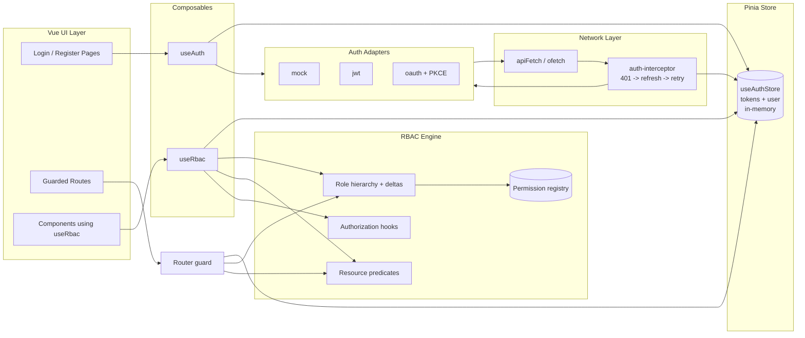

---

## 2. Token storage & session lifetime

### Session state machine

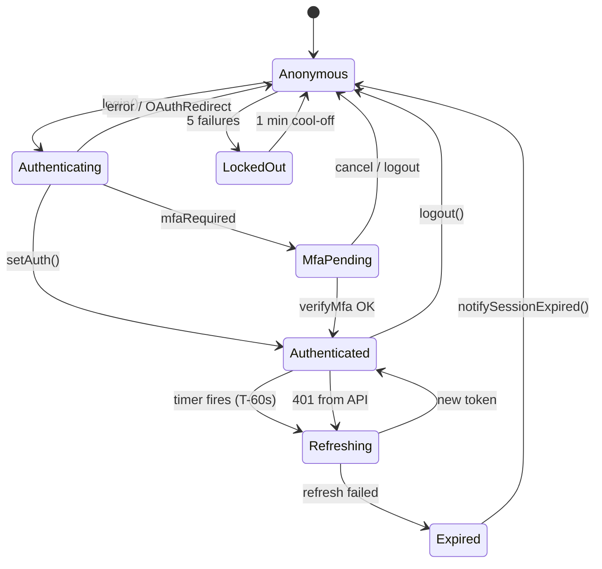

### Why in-memory only

Tokens (`access`, `refresh`) and the `User` object live **only inside the
Pinia store** — they are never written to `localStorage` or `sessionStorage`.

This is a deliberate XSS-mitigation strategy:

- Any persisted token is reachable by injected JS. By keeping tokens in JS
  closures (the store's reactive refs), an attacker who already has script
  execution still cannot exfiltrate the bearer to a separate origin via the
  storage APIs.
- A real backend should set the **refresh token in an `HttpOnly; Secure;
SameSite=Strict` cookie** so it is unreachable by JS entirely. The mock
  adapter keeps it in memory because there is no server.
- Page refresh logs the user out under the mock adapter — this is correct
  for a demo. Production adapters restore the session via the cookie
  (see §6 _Session restoration_).

### Demo-Mode Persistence

In a **demo build** the mock adapter supplements the in-memory store with
**IndexedDB persistence** so demo sessions survive page reloads:

- `src/modules/app/state/demo/index.ts` — the single barrel. Every application-code path into demo state goes through here, behind `if (__VUESTRATA_DEMO__)`, via a dynamic `import()`. That guard is what lets rolldown remove the whole subtree from a production bundle.
- `src/modules/app/state/demo/account.ts` — the demo credentials, defined once and shared by the login hint, the MSW handler, the seed routine, and the e2e helpers.
- `src/modules/app/state/demo/seed.ts` — seeds the demo super-admin with every permission in the RBAC registry. Called from exactly one place: the `__VUESTRATA_DEMO__` branch in `main.ts`.
- `src/modules/app/state/demo-persistence.ts` — low-level IndexedDB helper with in-memory fallback for environments where IndexedDB is unavailable (SSR, unit tests).
- `src/modules/app/state/demo-storage.ts` — wraps records in a `DemoEnvelope` (version, `expiresAt`, `integrityHash`). Envelopes failing validation are discarded fail-closed.
- `src/modules/app/state/demo-store.ts` — typed `getDemoSession` / `setDemoSession` / `clearDemoSession`.
- Cross-tab sync via `BroadcastChannel('vuestrata-demo-auth')`.

`integrityHash` is a **salted SHA-256 digest, not an HMAC**, and its salt is a
public constant in the client bundle. It catches accidental corruption and
version skew; it is not tamper resistance and not a security boundary.

This path is entirely separate from the production token lifecycle. Real
adapters (jwt/oauth) never touch IndexedDB, and in a production build none of
these modules are present at all — `scripts/build/verify-bundle.mjs` fails CI if
any of them reappear.

### Store surface

The store is intentionally minimal and **framework-agnostic** — it never
imports adapters or fetch logic.

```ts
// src/modules/app/stores/auth.ts (excerpt)
const user = ref<User | null>(null)
const token = ref<string | null>(null)
const refreshToken = ref<string | null>(null)

let refreshTimer: ReturnType<typeof setTimeout> | null = null
let refreshHandler: (() => void | Promise<void>) | null = null

const isAuthenticated = computed(() => !!token.value && !!user.value)
```

Public actions: `setAuth`, `setUser`, `clearAuth`, `setRefreshHandler`,
`scheduleTokenRefresh`, `clearRefreshTimer`.

### Proactive refresh scheduler

`setAuth(user, token, refreshToken, expiresIn)` calls
`scheduleTokenRefresh(expiresIn)` which:

1. Cancels any existing timer.
2. Computes `refreshInMs = max((expiresIn - 60) * 1000, 5000)` — refresh 60 s
   before expiry, never sooner than 5 s from now.
3. Schedules a `setTimeout` whose handler **re-checks `token.value` and
   `refreshToken.value`** before firing. If either is null (user logged out,
   401 already cleared the session, etc.), the handler is skipped. This
   guard exists because a stale refresh would otherwise hit the backend with
   discarded credentials.

The refresh callback itself is supplied at bootstrap from `main.ts`:

```ts
authStore.setRefreshHandler(async () => {
  const rt = authStore.refreshToken
  if (!rt) return
  try {
    const adapter = createAuthAdapter(configuredAuthAdapter)
    const result = await adapter.refreshToken(rt)
    if (authStore.user) {
      authStore.setAuth(authStore.user, result.token, result.refreshToken, result.expiresIn)
    }
  } catch (err) {
    logger.warn('Proactive token refresh failed — falling back to 401 interceptor', { err })
  }
})
```

The store stays adapter-free; the auth layer injects the strategy at startup.

---

## 3. Adapters

### Adapter class diagram

```mermaid
classDiagram
  class AuthAdapter {
    <<interface>>
    +login(credentials) AuthResponse
    +register(credentials) AuthResponse
    +logout() void
    +getUser() User
    +refreshToken(token) AuthResponse
    +socialLogin(provider) void
    +sendMagicLink(req) Message
    +verifyMagicLink(token) AuthResponse
    +setupMfa() MfaSetupResponse
    +verifyMfa(req) AuthResponse
    +disableMfa() void
  }

  class MockAdapter {
    -msw handlers
    +login()
    +refreshToken()
  }

  class JwtAdapter {
    -inner: MockAdapter
    -isTokenExpired(t) boolean
    +login()
    +getUser()
  }

  class OAuthAdapter {
    -pkce: { verifier, challenge }
    -state: string
    +login() throws OAuthRedirectError
    +handleCallback(code, state)
  }

  class OAuthRedirectError {
    <<error>>
    +message: 'redirect-in-progress'
  }

  AuthAdapter <|.. MockAdapter
  AuthAdapter <|.. JwtAdapter
  AuthAdapter <|.. OAuthAdapter
  JwtAdapter o-- MockAdapter : delegates
  OAuthAdapter ..> OAuthRedirectError : throws
```

The `AuthAdapter` interface is the only contract every strategy must satisfy:

```ts
interface AuthAdapter {
  readonly name: SupportedAuthAdapter
  readonly transport: AuthTransport // 'bearer' | 'cookie'
  readonly capabilities: AuthCapabilities

  // Required — every adapter can start a session, end one, identify the user.
  login: (credentials: AuthCredentials) => Promise<AuthResponse>
  logout: () => Promise<void>
  getUser: () => Promise<User | null>

  // Optional — presence must match the matching `capabilities` flag.
  register?: (credentials: AuthCredentials & { name: string }) => Promise<AuthResponse>
  refreshToken?: (token: string) => Promise<AuthResponse>
  socialLogin?: (provider: AuthProvider) => Promise<void>
  sendMagicLink?: (request: MagicLinkRequest) => Promise<{ message: string }>
  verifyMagicLink?: (token: string) => Promise<AuthResponse>
  setupMfa?: () => Promise<MfaSetupResponse>
  verifyMfa?: (request: MfaVerifyRequest) => Promise<AuthResponse>
  disableMfa?: () => Promise<void>
  exchangeCode?: (code: string, state: string) => Promise<AuthResponse>
}
```

Two deliberate design points:

- **Optional methods plus `capabilities`.** All eleven used to be required, so
  an adapter that could not honour one either threw at call time or silently
  no-oped. Now the UI reads `capabilities` and hides the affordance instead.
  `requireCapability()` guards each call and throws an error naming the adapter
  and the capability.
- **`exchangeCode` is on the interface.** It used to be a free function the
  callback page imported directly, which left the flow's most
  security-sensitive step outside the contract entirely.

`createAuthAdapter(name)` is a factory:

```ts
export function resolveAuthAdapterName(adapterName: string | undefined): SupportedAuthAdapter
export function createAuthAdapter(
  adapterName: string | undefined,
  options?: { getToken?: () => string | null },
): AuthAdapter
```

`getToken` is threaded in for the JWT adapter's expiry check — a callback rather
than a value, since the adapter is built once and the token rotates.

`resolveAuthAdapterName` clamps unknown values to `'mock'` and logs a
warning, so a typo in the env never silently disables auth.

Each adapter lives in its own file under
[src/modules/auth/adapters/](../../src/modules/auth/adapters/), sharing the wire
calls in `base.ts`. They previously all lived in one 606-line file.

### Mock adapter

`transport: 'bearer'`. Hits the MSW handlers in
[src/modules/auth/mocks/auth.handlers.ts](../../src/modules/auth/mocks/auth.handlers.ts).
Demo builds only — the env schema rejects `mock` outside demo mode. It mints an
unsigned JWT so the demo exercises the same header path a real bearer backend
would, and validates the seeded account's password against `DEMO_ACCOUNT`.

### JWT adapter

`transport: 'bearer'`. Credentials plus access/refresh tokens, with
**token-expiry awareness** in `getUser`:

```ts
export function isJwtExpired(token: string): boolean {
  const payload = jwtDecode<{ exp?: number }>(token)
  // No exp is treated as expired: a non-expiring access token is either a
  // misconfiguration or not an access token. Fail closed.
  if (!payload.exp) return true
  return Date.now() >= (payload.exp - 30) * 1000 // 30 s clock-skew margin
}
```

`getUser` returns `null` without issuing a request when the held token is
already expired, so session restoration does not burn a round trip or trip the
401 interceptor.

> **Previously:** `createJwtAdapter()` was literally `return createBaseAdapter()`
> — a no-op wrapper. `isJwtExpired` existed but was called from nowhere, so the
> behaviour documented above did not happen, and a missing `exp` was treated as
> _valid_ rather than expired.

### OAuth adapter

Implements **Authorization Code with PKCE** (RFC 7636). Helpers live in
[src/modules/auth/lib/pkce.ts](../../src/modules/auth/lib/pkce.ts):

- `generateCodeVerifier()` — 64-byte cryptographic random string.
- `generateCodeChallenge(verifier)` — `BASE64URL(SHA256(verifier))`.
- `generateState()` — opaque CSRF nonce stored in `sessionStorage` for
  validation when the provider redirects back.

`login()` triggers the redirect and **throws `OAuthRedirectError`**:

```ts
throw new OAuthRedirectError()
```

This sentinel is critical. The previous implementation returned a
never-resolving promise, which caused awaiters to hang and the lockout
counter to mistakenly increment. The composable now detects it:

```ts
catch (e) {
  if (e instanceof OAuthRedirectError) {
    // Not a failure — page is being replaced by the IdP redirect.
    return
  }
  recordFailedAttempt()
  throw e
}
```

---

## 4. Login flow (step-by-step)

### Credentials login sequence

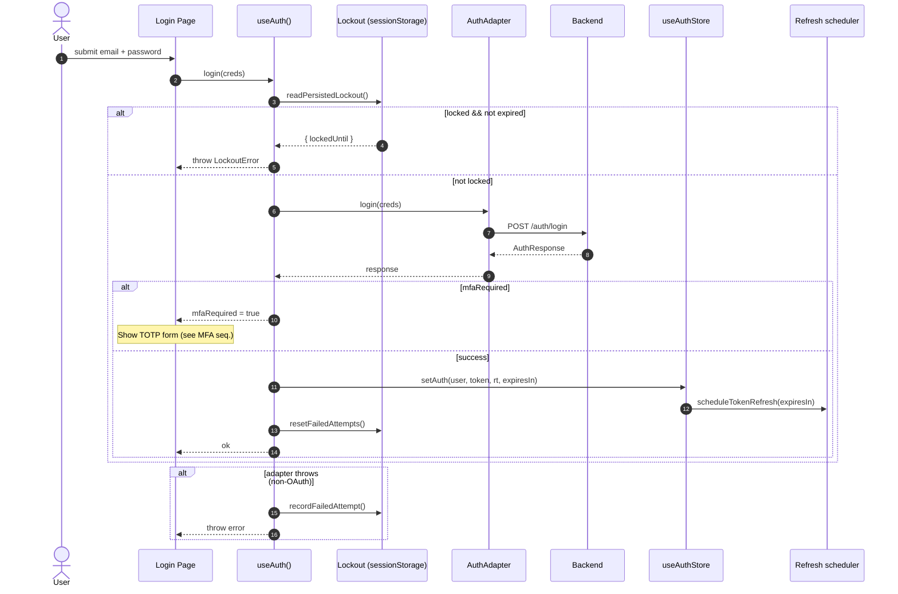

### MFA verification sequence

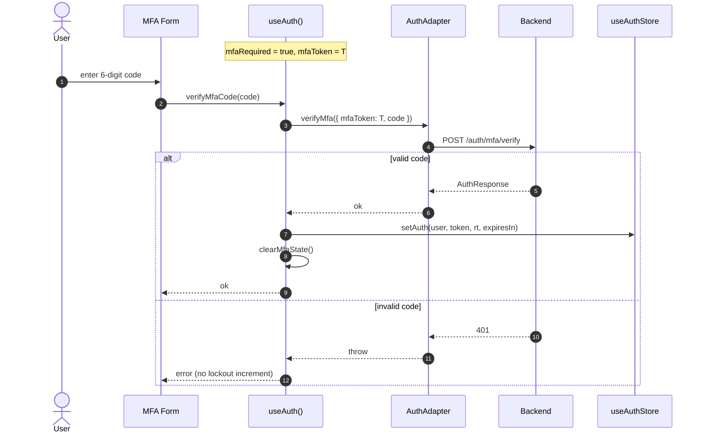

### OAuth (Authorization Code + PKCE) sequence

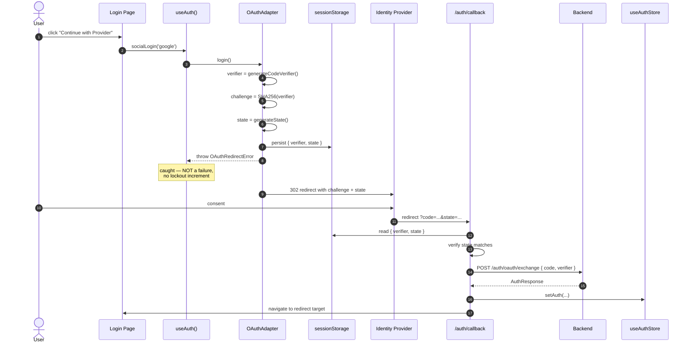

### Lockout state machine

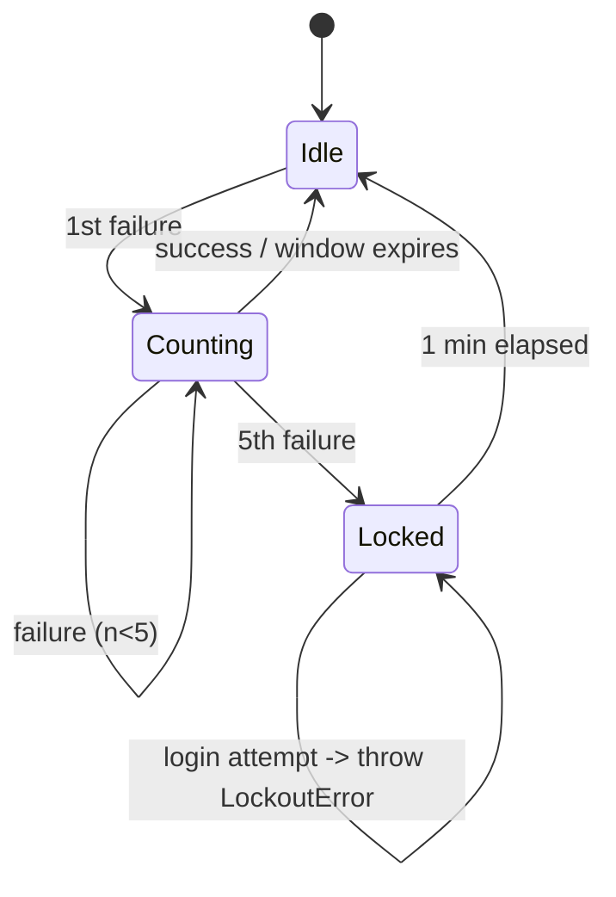

### Lockout

After **5 failed attempts**, login is blocked for **1 minute** (`LOCKOUT_DURATION_MS` in `auth/stores/challenge.ts`). This is a client-side UX guard held in `sessionStorage`, trivially bypassed by clearing storage — real brute-force protection must live on the backend.
State lives in `sessionStorage` under `vuestrata-auth-lockout`:

```jsonc
{
  "failedAttempts": 5,
  "firstFailedAt": 1745300000000,
  "lockedUntil": 1745300900000,
}
```

Module-scoped helpers (`readPersistedLockout`, `writePersistedLockout`,
`syncLockout`) keep the in-memory refs and storage in sync, and discard
expired records on read so a stale lockout cannot survive a slow tab
restore. **Why sessionStorage and not localStorage?** Lockout protects the
current browsing session from brute force; persisting across windows would
needlessly punish a different user on a shared machine.

### MFA

When the backend returns `{ mfaRequired: true, mfaToken }`, the composable
stores both in **module-level refs** (`mfaRequired`, `mfaToken`). The UI
binds to `useAuth().mfaRequired` to show a TOTP form, then calls
`verifyMfaCode(code)` which:

1. Posts `{ mfaToken, code }` to `adapter.verifyMfa`.
2. On success → `setAuth(...)` + `clearMfaState()`.
3. On failure → throws (lockout is **not** incremented; MFA failures use a
   separate counter governed by the backend).

`logout()` always calls `clearMfaState()` so a half-completed challenge
can never bleed into the next session.

---

## 5. API interceptor: 401 → refresh → retry

Every API call goes through `apiFetch` in
[src/modules/core/lib/api/client.ts](../../src/modules/core/lib/api/client.ts).

```
onRequest:
   • Add `Authorization: Bearer <token>` if logged in
   • Add `X-CSRF-Token: <cached>` if available

onResponseError(401):
   • For non /auth/* requests → handleTokenRefresh(...)
   • If refresh succeeded → retry with new bearer
   • Else → notifySessionExpired() → adapter clears auth → router → /auth/login
```

### Refresh-on-401 sequence (single request)

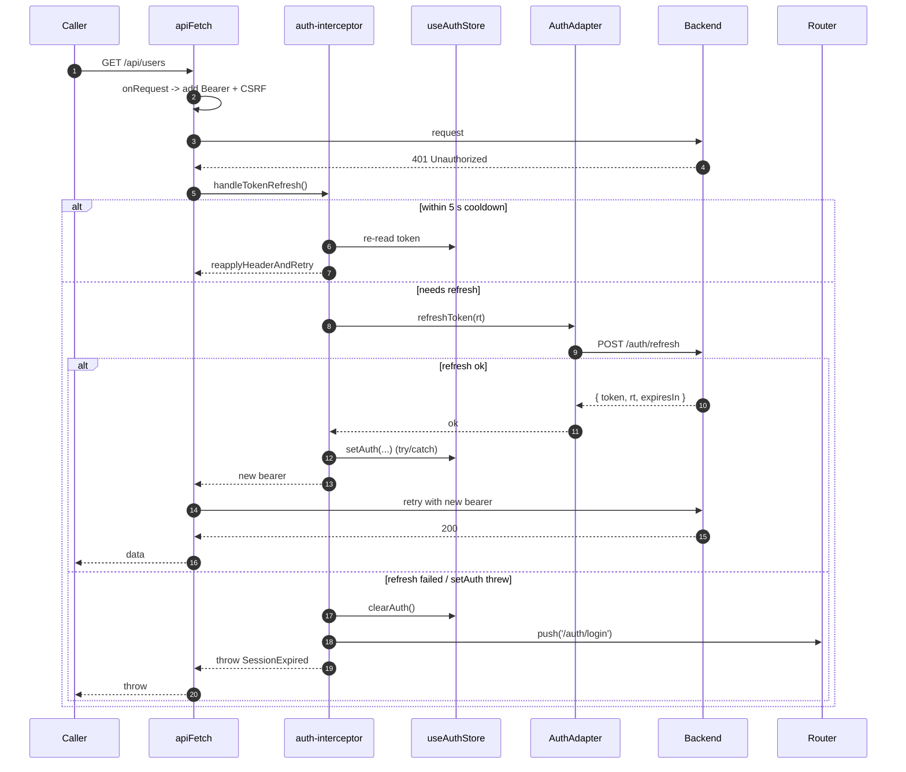

### Concurrent 401s — refresh dedup

```mermaid
sequenceDiagram
  autonumber
  participant R1 as Request A
  participant R2 as Request B
  participant R3 as Request C
  participant Int as auth-interceptor
  participant API as Backend

  par parallel 401s
    R1->>Int: 401 -> refresh?
    R2->>Int: 401 -> refresh?
    R3->>Int: 401 -> refresh?
  end
  Note over Int: refreshPromise == null -> create one
  Int->>API: POST /auth/refresh (single call)
  Note over R1,R3: A, B, C all await<br/>the SAME refreshPromise
  API-->>Int: { token, ... }
  Int-->>R1: new bearer
  Int-->>R2: new bearer
  Int-->>R3: new bearer
  Note over Int: lastRefreshedAt = now;<br/>requests arriving in next 5 s<br/>skip refresh entirely
```

### Refresh dedup with cooldown

`handleTokenRefresh` solves a textbook race: if 10 requests fly out in
parallel and all 10 receive 401, you must not trigger 10 refreshes.

```ts
let refreshPromise: Promise<string | null> | null = null
let lastRefreshedAt = 0
const REFRESH_COOLDOWN_MS = 5_000

if (Date.now() - lastRefreshedAt < REFRESH_COOLDOWN_MS) {
  // Token was just refreshed by another in-flight request —
  // re-apply the now-current bearer instead of refreshing again.
  return reapplyHeaderAndRetry()
}

if (!refreshPromise) {
  refreshPromise = refreshAccessToken(baseURL).finally(() => {
    refreshPromise = null
  })
}
const newToken = await refreshPromise
```

Two layers of protection:

1. **In-flight dedup** — concurrent calls share one `refreshPromise`.
2. **Cooldown window** — calls that arrive _just after_ the promise
   resolves still skip the network and reuse the freshly-set bearer.
   Without this, a request could 401 right after `refreshPromise` was
   nulled and trigger a redundant refresh.

### Refresh persistence guard

`authProvider.setAuth(...)` is wrapped in `try/catch`. If persistence
throws (storage quota, store teardown mid-flight), the refresh is treated
as **failed** — better to escalate to the session-expired path than to
return a token the store didn't actually accept.

### CSRF token caching

`getCsrfToken()` reads `<meta name="csrf-token">` once and memoises the
value. The cache is invalidated on any 403 response so a rotated token is
picked up on the next request.

### Server-error message hardening

5xx responses never forward the raw `response._data.message` to the UI —
backends frequently leak stack traces, internal paths, or query strings
in those messages. The interceptor and `normalizeError` substitute a
generic _"An unexpected error occurred. Please try again."_ and emit a
structured log line containing only `{ url, code, requestId }`.

---

## 6. Session restoration

### Bootstrap sequence

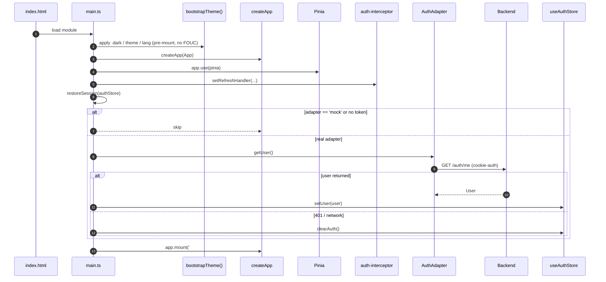

`bootstrap()` calls `restoreSession(authStore)` after Pinia is registered:

```ts
async function restoreSession(authStore) {
  if (configuredAuthAdapter === 'mock' || !authStore.token) return
  try {
    const adapter = createAuthAdapter(configuredAuthAdapter)
    const user = await adapter.getUser()
    if (user) authStore.setUser(user)
  } catch {
    logger.warn('Session restoration failed — starting unauthenticated')
    authStore.clearAuth()
  }
}
```

The mock adapter is intentionally skipped (no persisted token to restore).
Real adapters rely on the refresh-token cookie set by the backend — they
call `GET /auth/me` and trust the cookie to authenticate the request.

---

## 7. Logout

`useAuth().logout()` is structured as **client-side cleanup first**, with
the backend call best-effort:

```ts
async function logout() {
  try {
    await adapter.logout()
  } catch (err) {
    authLogger.warn('Logout API call failed (clearing local session anyway)', { err })
  }
  authStore.clearAuth() // wipes tokens + cancels refresh timer
  clearMfaState() // wipes any pending MFA challenge
  resetFailedAttempts() // resets lockout counter
}
```

A backend that is down must never trap the user in a logged-in state.

---

## 8. Authorization (RBAC)

### Role hierarchy

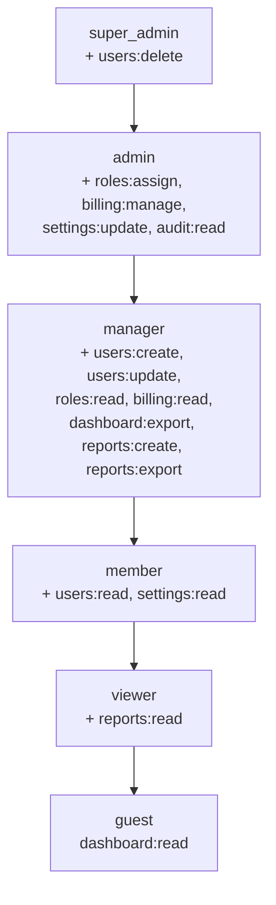

```
ROLE_HIERARCHY = ['super_admin', 'admin', 'manager', 'member', 'viewer', 'guest']
```

`isRoleAtLeast(userRole, required)` returns `true` when the user's index in
the array is **≤** the required role's index. Both roles are validated
against the hierarchy — any unknown role **fails closed** (returns `false`)
so a typo or stale enum value cannot accidentally elevate access.

### Delta-based role definitions

Each role lists only the permissions it **adds** beyond the next-lower
role. `resolveRolePermissions(role)` walks from `guest` up to the requested
role and unions the deltas. Result is cached per-role only for the lifetime
of the call (no global cache — keeps the engine HMR-safe in dev).

```
guest       → dashboard:read
viewer      → + reports:read
member      → + users:read, settings:read
manager     → + users:create, users:update, roles:read, billing:read,
                dashboard:export, reports:create, reports:export
admin       → + roles:assign, billing:manage, settings:update, audit:read
super_admin → + users:delete
```

### Permission registry

`registerPermissions(namespace, actions)` adds `'<namespace>:<action>'`
strings to a singleton `Set`. The 16 built-in permissions are seeded at
import time; modules add their own during registration.

`validateBuiltinRolePermissions()` is **explicitly invoked from
`initModules`** after every module has registered its permissions. Running
the check at import time would fire false-positive _"unregistered
permission"_ warnings for permissions whose owning module hadn't been
loaded yet.

### `useRbac()` — component API

Three-tier user-source resolution:

1. **Explicit param** — pass `{ role, permissions }` (best for testing).
2. **`provide` / `inject`** — parent component publishes `RBAC_USER_SOURCE_KEY`.
3. **`useAuthStore()` fallback** — derives `role` and `permissions` from the
   active session.

Methods: `can`, `canAny`, `canAll`, `canNamespace`, `isAtLeast`. Each
emits an `AuthorizationEvent` so audit/analytics hooks see every
component-level decision.

### Resource-scoped predicates

When ownership matters, register a predicate:

```ts
registerPredicate('users:update', ({ ownerId, currentUserId }) => ownerId === currentUserId)
```

`hasPermission(role, perms, 'users:update', { ownerId, currentUserId })`
runs the predicate first; if it returns `null` (no predicate registered or
context missing required keys), the standard role check applies. Predicates
**override** the role check when they return a boolean — a non-owner cannot
edit even if their role grants `users:update`.

### Authorization hooks

```ts
onAuthorizationCheck((event) => {
  if (!event.granted) analytics.track('access_denied', event)
})
```

Hooks fire for guard-, component-, and predicate-level checks. They are:

- **Synchronous** — runs in the same tick as the check.
- **Failure-isolated** — a throwing hook is logged but does not block
  others or affect the decision.
- **Multiple subscribers** — each `onAuthorizationCheck` call returns its
  own unsubscribe.

### Router guard

#### Guard decision flow

```mermaid
flowchart TD
  Start([navigation -> to]) --> A{to.meta.requiresAuth?}
  A -- no --> Allow([next])
  A -- yes --> B{authenticated?}
  B -- no --> Login[/redirect /auth/login<br/>?redirect=to.fullPath/]
  B -- yes --> C{requiredRole?}
  C -- yes --> C1{isRoleAtLeast?}
  C1 -- no --> F403[/redirect /403/]
  C1 -- yes --> D
  C -- no --> D{permissionContext?}
  D -- yes --> D1{resolver throws?}
  D1 -- yes --> F403
  D1 -- no --> E
  D -- no --> E{requiredPermission(s)?}
  E -- no --> Allow
  E -- single --> E1{hasPermission?}
  E -- multi/all --> E2{hasAllPermissions?}
  E -- multi/any --> E3{hasAnyPermission?}
  E1 -- yes --> Allow
  E2 -- yes --> Allow
  E3 -- yes --> Allow
  E1 -- no --> F403
  E2 -- no --> F403
  E3 -- no --> F403
```

#### Guard sequence

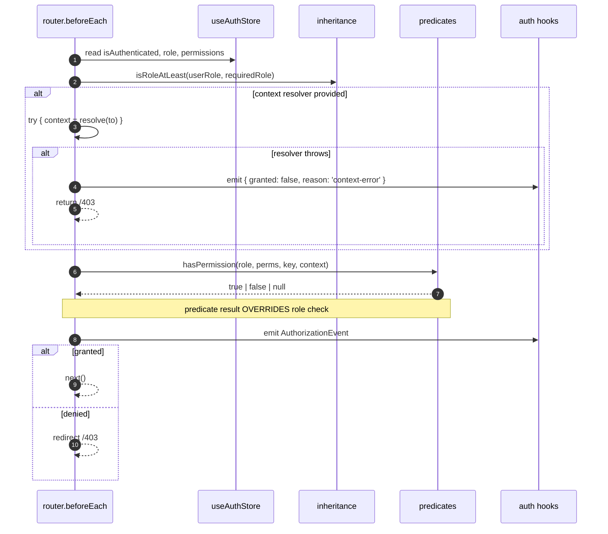

```ts
router.beforeEach((to) => {
  if (to.meta.requiresAuth && !authStore.isAuthenticated) {
    return { path: '/auth/login', query: { redirect: to.fullPath } }
  }

  if (authStore.isAuthenticated) {
    if (to.meta.requiredRole && !isRoleAtLeast(userRole, to.meta.requiredRole)) {
      return { path: '/403' }
    }

    let context: Record<string, unknown> | undefined
    if (to.meta.permissionContext) {
      try {
        context =
          typeof to.meta.permissionContext === 'function'
            ? to.meta.permissionContext(to)
            : to.meta.permissionContext
      } catch {
        // FAIL CLOSED — a context resolver that throws cannot be trusted
        // to provide the data a predicate needs.
        emitAuthorizationEvent({/* ... */})
        return { path: '/403' }
      }
    }

    // Multi-permission (precedence) or single-permission check…
  }
})
```

Two security-critical behaviours:

1. **Context resolver throws → `/403`.** Previously the guard fell back to
   the base role check, which silently bypassed the resource-scoped
   predicate (potential escalation). It now denies.
2. **Multi-permission `mode: 'all'` is the default.** Routes that require
   any-one-of-N must opt in explicitly (`permissionMode: 'any'`).

---

## 9. Threat model & defences

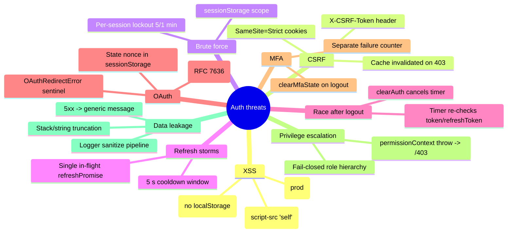

| Threat                                    | Mitigation                                                                                                                                                                                                                            |
| ----------------------------------------- | ------------------------------------------------------------------------------------------------------------------------------------------------------------------------------------------------------------------------------------- |
| **XSS-stolen tokens**                     | Tokens in JS closures, never `localStorage`; refresh token belongs in HttpOnly cookie on a real backend.                                                                                                                              |
| **CSRF**                                  | `X-CSRF-Token` injected from `<meta>` tag on every request; cache invalidated on 403; `credentials: 'include'` only when cookie auth is used.                                                                                         |
| **Brute-force login**                     | Client-side lockout (5 attempts → 1 min cool-off) in `sessionStorage`. A UX guard only; enforce real rate limiting on the backend.                                                                                                    |
| **Refresh storms**                        | Single in-flight refresh + 5 s cooldown window in the API interceptor.                                                                                                                                                                |
| **Race after logout**                     | Refresh-timer guard re-checks `token`/`refreshToken` before firing; cleared inside `clearAuth()`.                                                                                                                                     |
| **OAuth promise hang**                    | `OAuthRedirectError` sentinel signals "page about to redirect" so callers don't increment lockout or block UI.                                                                                                                        |
| **MFA token leak across logout**          | `clearMfaState()` runs in `logout` and after successful verification.                                                                                                                                                                 |
| **Privilege escalation via guard bypass** | `permissionContext` resolver failure now redirects to `/403`.                                                                                                                                                                         |
| **Permission typos**                      | `validatePermissions()` runs after module registration; unregistered keys are logged.                                                                                                                                                 |
| **Backend leakage in error UI**           | 5xx messages replaced with generic copy in both `apiFetch.onResponseError` and `normalizeError`.                                                                                                                                      |
| **PII in logs**                           | `logger` runs every argument through a `sanitize()` pipeline that redacts keys matching `/token\|password\|secret\|authorization\|api[_-]?key\|cookie\|refresh/i`, caps depth and string length, slices stack traces, handles cycles. |

OWASP Top 10 alignment:

- **A01 Broken Access Control** — fail-closed role hierarchy + guard, predicates for ownership, audit hooks.
- **A02 Cryptographic Failures** — PKCE for OAuth; tokens held in memory only for the `jwt` and `oauth` adapters. The `mock` adapter does persist its tokens to IndexedDB, but exists only in demo builds.
- **A03 Injection** — strict CSP (`script-src 'self'`), no `eval`, sanitised theme/locale read in [bootstrap-theme.ts](../../src/modules/app/plugins/bootstrap-theme.ts).
- **A05 Security Misconfiguration** — full security header set in `_headers` and the nginx config; Docker runs unprivileged with read-only FS.
- **A07 Identification & Auth Failures** — MFA flow, lockout, secure refresh dedup.

---

## 10. Extension cookbook

### Adding a new permission

```ts
// src/modules/<your-module>/index.ts
const myModule: ModuleDefinition = {
  config: {
    id: 'reports',
    permissions: ['read', 'create', 'export'], // → reports:read, reports:create, reports:export
    // ...
  },
}
```

The module loader calls `registerPermissions(config.id, config.permissions)`
during `initModules`. The validator picks them up automatically.

### Adding a new role

Add a delta entry in [rbac/inheritance.ts](../../src/modules/core/lib/rbac/inheritance.ts):

```ts
const ROLE_DELTA_DEFINITIONS: Record<Role, ...> = {
  // ...
  auditor: {
    label: 'Auditor',
    description: 'Read-only audit log access',
    delta: ['audit:read'],
  },
}
```

Then insert the role into `ROLE_HIERARCHY` at the correct position
(determines who inherits its permissions). Update the `Role` type union in
[types](../../src/modules/core/lib/rbac/types.ts).

### Plugging in a real backend

1. Implement `AuthAdapter` in a new factory (e.g. `createSupabaseAdapter`).
2. Register it in `createAuthAdapter`'s switch (or wire the env-var lookup).
3. Ensure the backend sets the refresh token in an `HttpOnly; Secure;
SameSite=Strict` cookie.
4. Implement `GET /auth/me` so `restoreSession()` can rehydrate the user
   from the cookie on page load.
5. Implement `POST /auth/refresh` returning `{ token, refreshToken,
expiresIn }`. The interceptor will call this automatically.
6. Add a `<meta name="csrf-token">` to the SSR HTML if the backend uses
   double-submit-cookie CSRF; otherwise rely on `SameSite` cookies alone.

### Writing tests

Use `useRbac` with explicit user source to avoid Pinia setup:

```ts
const { can } = useRbac({
  role: ref<Role>('manager'),
  permissions: ref<Permission[]>(['users:read']),
})

expect(can('users:read')).toBe(true)
expect(can('users:delete')).toBe(false)
```

For auth-store flows, swap the adapter with a stub:

```ts
import { createAuthAdapter } from '@/modules/auth'

vi.mock('@/modules/auth', async (orig) => ({
  ...(await orig<typeof import('@/modules/auth')>()),
  createAuthAdapter: () => stubAdapter,
}))
```

Authorization hooks make integration testing easy:

```ts
const events: AuthorizationEvent[] = []
const off = onAuthorizationCheck((e) => events.push(e))
// ...trigger flow...
off()
expect(events).toContainEqual(expect.objectContaining({ permission: 'users:read', granted: true }))
```

---

## 11. File map

```
src/modules/auth/
├── adapters/
│   ├── types.ts                    # AuthAdapter contract, transport, capabilities
│   ├── base.ts                     # shared endpoint calls (all via apiFetch)
│   ├── mock.ts                     # demo adapter, bearer transport
│   ├── jwt.ts                      # bearer tokens + isJwtExpired
│   ├── oauth.ts                    # authorization code + PKCE, cookie transport
│   ├── pkce-state.ts               # sessionStorage handshake state + TTL
│   └── index.ts                    # createAuthAdapter, requireCapability
├── composables/useAuth.ts          # orchestration only: store wiring, redirects, lockout
├── lib/pkce.ts                     # verifier / challenge / state generation
├── stores/challenge.ts             # lockout counter + MFA challenge
├── mocks/auth.handlers.ts          # MSW handlers (demo builds only)
└── pages/                          # login, register, callback

src/modules/app/
├── stores/auth.ts                  # in-memory token store, refresh scheduler
├── composables/useRbac.ts          # component-facing permission API
├── state/demo/                     # demo boundary — see §2
│   ├── index.ts                    # the only entry point, behind __VUESTRATA_DEMO__
│   ├── account.ts                  # DEMO_ACCOUNT, single source of truth
│   └── seed.ts                     # seeds the demo super-admin
└── plugins/
    ├── router.ts                   # installs the guard
    ├── route-guard.ts              # resolveRouteAccess() — pure, unit-tested
    └── bootstrap-theme.ts          # pre-mount FOUC guard (theme, dark, locale)

src/modules/core/lib/
├── config/env.schema.ts            # zod env validation, shared with vite.config.ts
├── api/
│   ├── client.ts                   # apiFetch + transport-aware credentials/CSRF
│   ├── auth-interceptor.ts         # 401 → refresh dedup + cooldown, transport-aware
│   └── types.ts                    # ApiAuthProvider + ApiAuthTransport
├── rbac/
│   ├── registry.ts                 # permission Set + validator
│   ├── inheritance.ts              # delta-based role resolution
│   ├── checks.ts                   # has/Any/All permission
│   ├── predicates.ts               # resource-scoped overrides
│   ├── hooks.ts                    # authorization event bus
│   └── index.ts                    # barrel + validateBuiltinRolePermissions()
├── errors/
│   ├── index.ts                    # AppError + normalizeError (5xx hardening)
│   └── reporter.ts                 # error-reporting adapter (no-op by default)
└── logger/index.ts                 # PII-sanitising consola wrapper

src/main.ts                         # bootstrap: pinia → auth interceptor → restore → mount
```

---

## 12. Change checklist for auth-touching PRs

Before merging anything in this surface, verify:

- [ ] **No tokens persisted to storage.** Search for `localStorage.setItem.*token` / `refreshToken`.
- [ ] **Adapter contract preserved.** Every `AuthAdapter` method is implemented; no caller does `(adapter as any).foo()`.
- [ ] **Refresh path tested.** Trigger 401 → verify single refresh, retry, and session-expired escalation.
- [ ] **Lockout still bounded.** Failed attempts increment, lockout expires, `sessionStorage` keys honoured.
- [ ] **Guard fail-closed.** Throwing `permissionContext` resolver still redirects to `/403`.
- [ ] **Permission validation runs after register.** `validateBuiltinRolePermissions` is called from `initModules`, not at import.
- [ ] **CSRF cache invalidated on 403.** `getCsrfToken` re-reads after an auth-server token rotation.
- [ ] **Logger sanitisation respected.** New log calls don't bypass `createScopedLogger`.
- [ ] **5xx error messages stay generic** in both `apiFetch.onResponseError` and `normalizeError`.
- [ ] **Quality gates pass:** `vp check` and `vp test` clean.
